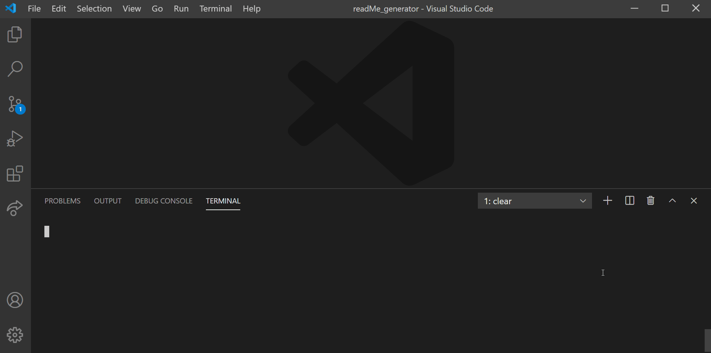

  # README Generator
  ## Table of contents
  ---
  [Description](#description)

  [Installation](#installation)

  [Usage](#usage)

  [Tests](#tests)

  [Contributing](#contributing)

  [Questions](#questions)

  [Lisence](#lisence)

  ## Description
  This is a command line application that quickly and easily generates a README file to accompany any application, and saves the developer time and effort. This README was generated completely by use of this application.
  ## Installation
  To install this application open an integrated terminal and enter the following into the command line:

  `npm i`
  ## Usage
  After installation enter the following command into your integrated terminal:

  `node index.js`

  ## Tests
  `There are no tests currently for this application`
  ## Contributing
  Please note that this project is released with a Contributor Code of Conduct. By participating in this project you agree to abide by its terms.
  
  ## Questions
  [GitHub Repository](https://github.com/geoff7709/readMe_generator)

  For further questions please feel free to email the developers:

  geoffzimmerman23@gmail.com
  ## Lisence
  Use of this software is regulated under the following lisence:

  [MIT](https://opensource.org/licenses/MIT)

  

